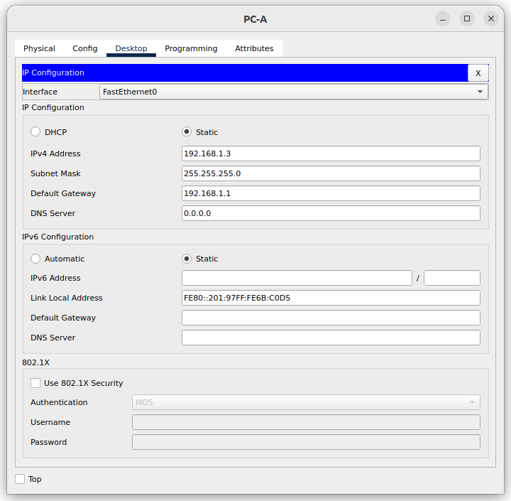
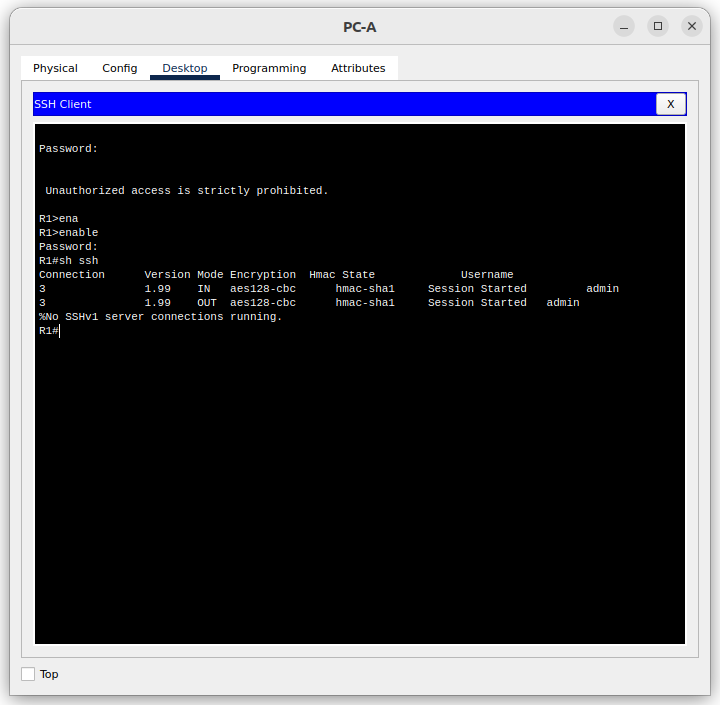

# Лабораторная работа. Доступ к сетевым устройствам по протоколу SSH

## Топология

## Таблица адресации

|Устройство | Интерфейс | IP-адрес         | Маска подсети  |   Шлюз по умолчанию   |
|-----------|-----------|------------------|----------------|-----------------------|
|R1         |G0/0/1     |192.168.1.1       | 255.255.255.0  |   -                   |
|S1         |VLAN 1     |192.168.1.11      | 255.255.255.0  |   192.168.1.1         |
|PC-A       |NIC        |192.168.1.3       | 255.255.255.0  |   192.168.1.1         |

### Задачи

    Часть 1. Настройка основных параметров устройства
    Часть 2. Настройка маршрутизатора для доступа по протоколу SSH
    Часть 3. Настройка коммутатора для доступа по протоколу SSH
    Часть 4. SSH через интерфейс командной строки (CLI) коммутатора

### Решение

*Файл CPT с полностью настроенным оборудованием [тут](lab_05.pkt)*

#### Часть 1. Настройка топологии и конфигурация основных параметров маршрутизатора и коммутатора

После подключения сети, инициализации и перезагрузки маршрутизатора и коммутатора выполнил следующие действия:

##### Шаг 1. Настройка маршрутизатора

    a. Подключившись к маршрутизатору с помощью консоли активировал привилегированный режим EXEC.
    b. Перешел в режим конфигурации командой **conf t**.
    c. Отключил поиск DNS командой **no ip domain-lookup**.
    d. Командой **enable secret class** установил зашифрованный пароль привилегированного режима EXEC.
    e. Командами **line con 0 > password cisco > login** установил cisco в качестве пароля консоли и включил вход в систему по паролю.
    f. Используя команды **line vty 0 4 > passord cisco > login ** назначил пароль VTY и включил вход в систему по паролю.
    g. Включил шифрование открытых паролей **service password-encryption**.
    h. Создал баннер, который предупреждает о запрете несанкционированного доступа.
    i. Установил имя маршрутизатора **hostname R1** 
    j. Настроил и активировал на маршрутизаторе интерфейс G0/0/1, используя информацию, приведенную в таблице адресации.
        R1(config)#int g0/0/1
        R1(config-if)#ip address 192.168.1.1 255.255.255.0
        R1(config-if)#no shutdown
    j. Сохранил текущую конфигурацию в файл загрузочной конфигурации:
        R1# copy run startup-config 

##### Шаг 2. Настроил компьютер PC-A

##### Шаг 3. Проверка подключения к сети

Послал команду **ping** с компьютера на маршрутизатор R1:
    C:\> ping 192.168.1.1

    Pinging 192.168.1.1 with 32 bytes of data:

    Reply from 192.168.1.1: bytes=32 time<1ms TTL=255
    Reply from 192.168.1.1: bytes=32 time<1ms TTL=255
    Reply from 192.168.1.1: bytes=32 time<1ms TTL=255
    Reply from 192.168.1.1: bytes=32 time<1ms TTL=255

    Ping statistics for 192.168.1.1:
        Packets: Sent = 4, Received = 4, Lost = 0 (0% loss),
    Approximate round trip times in milli-seconds:
        Minimum = 0ms, Maximum = 0ms, Average = 0ms

Эхо-запросы проходят - сеть работает.

#### Часть 2. Настройка маршрутизатора для доступа по протоколу SSH

##### Шаг 1. Настройка аутентификацию устройств

a. Имя устройства назначил на предыдущем шаге

b. Задал домен для устройства:
    `R1(config)#ip domain-name otus.cisco`

##### Шаг 2. Создание ключа шифрования

a. Создал ключ шифрования командой **crypto key generate rsa** и указал длину ключа 1024 бита.

##### Шаг 3. Создание пользователя

Настроил имя пользователя:
`R1(config)#username admin password Adm1nP@55`

##### Шаг 4. Активация протокола SSH на линиях VTY

a. Активировал протокол SSH на входящих линиях VTY с помощью команды **transport input**.
b. Изменил способ входа в систему таким образом, чтобы использовалась проверка пользователей по локальной базе учетных записей.

    R1(config-line)#line vty 0 4
    R1(config-line)#transport input ssh
    R1(config-line)#login local

##### Шаг 5. Сохранение текущей конфигурации в файл загрузочной конфигурации

Используя **R1# copy run startup-config** сохранил все изменения в файл загрузочной конфигурации.

##### Шаг 6. Установка соединения с маршрутизатором по протоколу SSH

a. Запустите SSH-клиента на PC-A.
b. Установил SSH-подключение к R1.

#### Часть 3. Настройка коммутатора для доступа по протоколу SSH

##### Вопросы для повторения

    1. Почему обоим интерфейсам Ethernet на R1 можно назначить один и тот же локальный адрес канала — FE80::1?
        Локальный адрес канала(LLA) используется для обмена данными с другими устройствами по **одному локальному каналу**. LLA не являются маршрутизируемыми и ограничиваются одним каналом. Т.е. Link-local пакеты никогда не покидают локальную сеть, поэтому один и тот же link-local адрес может использоваться на интерфейсе, связанном с другой локальной сетью.

    2. Какой идентификатор подсети в индивидуальном IPv6-адресе 2001:db8:acad::aaaa:1234/64?
       Глобальный префикс маршрутизации - 48 бит. Он включает первые три хекстета. 
       Четвертый хекстет и является искомым **идентификатором подсети** IPv6-адреса с префиксом /64.
       Адрес **2001:db8:acad::aaaa:1234/64** можно представить, как 2001:db8:acad:**0000**::aaaa:1234/64. То есть четвертый хекстет содержит все нули.
       Т.е. идентификатор подсети - 0 (ноль) или 0000.

S1#ping 192.168.1.1

Type escape sequence to abort.
Sending 5, 100-byte ICMP Echos to 192.168.1.1, timeout is 2 seconds:
.!!!!
Success rate is 80 percent (4/5), round-trip min/avg/max = 0/0/0 ms

S1#ping 192.168.1.3

Type escape sequence to abort.
Sending 5, 100-byte ICMP Echos to 192.168.1.3, timeout is 2 seconds:
.!!!!
Success rate is 80 percent (4/5), round-trip min/avg/max = 0/0/0 ms

S1#

Password: 

CAN't TOUCH THIS 

S1>en
S1>enable 
Password: 
S1#

S1#ssh ?
  -l  Log in using this user name
  -v  Specify SSH Protocol Version
S1#ssh -l admin 192.168.1.1

Password: 
% Login invalid

Password: 

 Unauthorized access is strictly prohibited. 

R1>
S1#
S1#
[Resuming connection 1 to 192.168.1.1 ... ]

R1>exit

[Connection to 192.168.1.1 closed by foreign host]
S1#

 Вы должны добавить имя пользователя и пароль каждого пользователя в локальную базу данных с помощью команды username. Также можно использовать сервер RADIUS или TACACS, но это еще не рассмотрено.